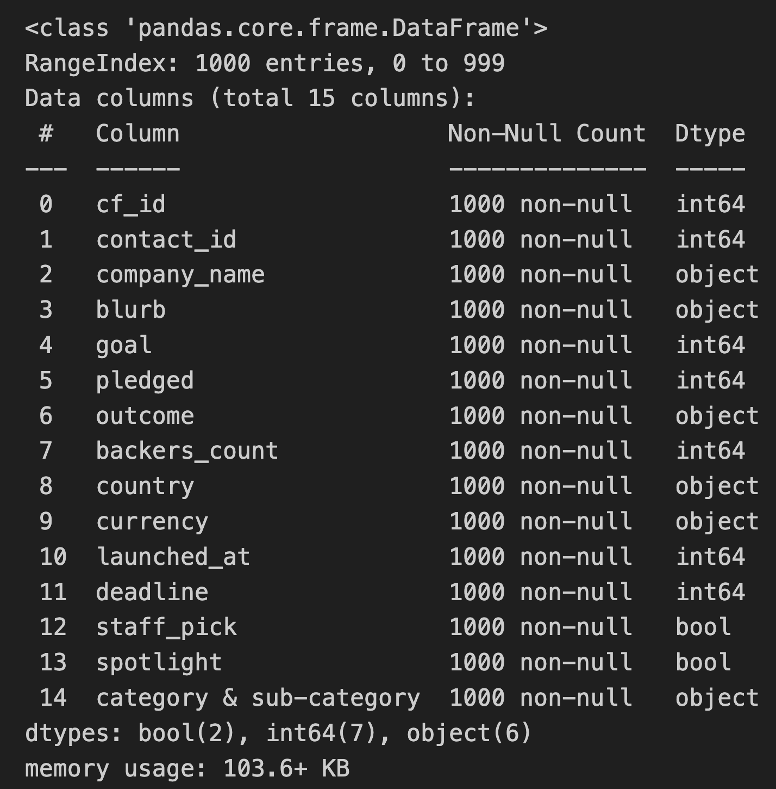

# Crowdfunding_ETL

An ETL (Extract Transform Load) mini project that uses Pyhton,Pandas, Numpy to create a PostgreSQL database which is managed with PgAdmin 4 . 

## Table of Contents
#### Introduction
#### Requirements & Dependencies
#### Analysis and Results
#### Usage
#### Contributing
#### License
 

#### Introduction
This ETL project demonstrates skills to extract and transform data using two xlsx files to export four csv files, which are then used to load tables in a PostgreSQL database managed by PgAdmin 4. 
- This project was completed by three persons: O Dumbuya, R Liu, and T Barnett. Each contributor's work is delineated below. 

#### Features
- Extract Data with Pandas 'read_excel' function. 

- Use NumPy 'arrange' function and list comprehension to create dataframe  subsets.  

- Use Pandas 'astype' and 'to-datetime' functions to convert data types.

- Use Pandas 'rename' function to rename columns.

- Use Pandas/Regex/JSON functions such as 'merge', 'drop', "itertuples' and 'split' to prepare data for appropriate normal form use in relational database.

 

#### Requirements & Dependencies
You will need the following software to run the ETL script:
- Python 3.10
- Pandas
- NumPy
- JSON
- PgAdmin 4 
- PostgreSQL Database Server
 

### Project Structure
### **Part 1.** 
##### Completed by R Liu
 
Use Pandas to read the crowdfunding.xlsx file into a DataFrame and check the head.

 
 

Get the summary of crowdfunding DataFrame. 

 
 

Check the crowndfunding DataFrame columns.

 
 

Split the 'category&sub-category' column to create two new columns: 'category' and ' subcategory. 

 
 

Create one list for 'catgeories' and another for 'subcategories'.

 
 

Get the number of distinct values in the 'categories' and 'subcategories' lists.

 
 

Create NumPy arrays for categories and subcategories.

 
 

Use list comprehension to prepare the category and subcategory values and the create two DataFrames for category and subcategory.  
  
 

Category DataFrame
 
 

Subcategory DataFrame
 
 
 

Export the category and subcategory DataFrames as two separate CSV files to the Resources folder. 
 
 
 

### **Part 2.** 
##### Completed by O Dumbuya
 

Create a campaign DataFrame as a copy of the crowdfunding Dataframe with the added category and subcategory columns, and then check the head.

 
 

i.  Rename the 'blurb', 'launched_at' and 'deadline' columns as 'description',   'launch_date' and 'end_date'.
ii. Convert the 'goal' and 'pledged' columns data types to float. 
iii. Check that the data types were changed.

 
 
i. Format the 'launch_date' and 'end_date' columns to YYYY-MM-DD format.
ii. Merge the campaign DataFrame to the category and subcategory DataFrames on category and subcategory, respectively.
iii. Drop the unwanted columns, and check the cleaned campaign Dataframe head. 

 
 
Export the clean campaign DataFrame as a CSV file to the Resources folder. 

 
 
 

### **Part 3.** 
##### Completed by R Liu
 

##### Option 1-Pandas

 

Use Pandas to read the contacts.xlsx file and check the head.

 
 

Convert each row of data to a dictionary and print out the results.

 
 

Create a contacts DataFrame with the dictionary values and check the head. 

 
 

Check the contact DataFrame data types.

 
 

i. Split the 'name' column to create a 'first_name' column and a 'last_name' column.
ii. Drop the 'name' column. 
iii. Reorder the columns: 'contact_id', 'first_name', 'last_name', 'email'.
iv. Check the Dataframe head. 

 
 

Check the clean contacts DataFrame datatypes and export the DataFrame as a CSV file to the Resources folder. 

 
 

##### Option 2-Regex
 
Make a copy of the contacts DataFrame that was created when Pandas was used to read the contacts.xlsx file in Option 1, and check the head.

 

 

---
*

 

---

---
#### Usage
1. Ensure that you have the appropriate CSV and XlSX files.
2. Run the  script in an appropriate code editor such as Jupyter Notebook. 
3. Run the app.py script in an appropriate code editor and render in a web browser such as Google Chrome with the necessary extensions, to optimize JSON, for example.

#### Contributions
Contributions to this project are highly encouraged! If you wish to contribute, please follow these guidelines:

- Fork the crowdfunding_ETL repository and clone it locally.
- Create a new branch for your feature or bug fix.
- Commit your changes with descriptive commit messages.
- Push your branch to your forked repository.
- Submit a pull request to the original repository.
- Please ensure that your code adheres to the project's coding style and conventions.

If you encounter any issues or have suggestions for improvements, please open an issue on the GitHub repository.

### License
These projects are licensed under the MIT License. Feel free to use, modify, and distribute the code as per the terms of the license. 